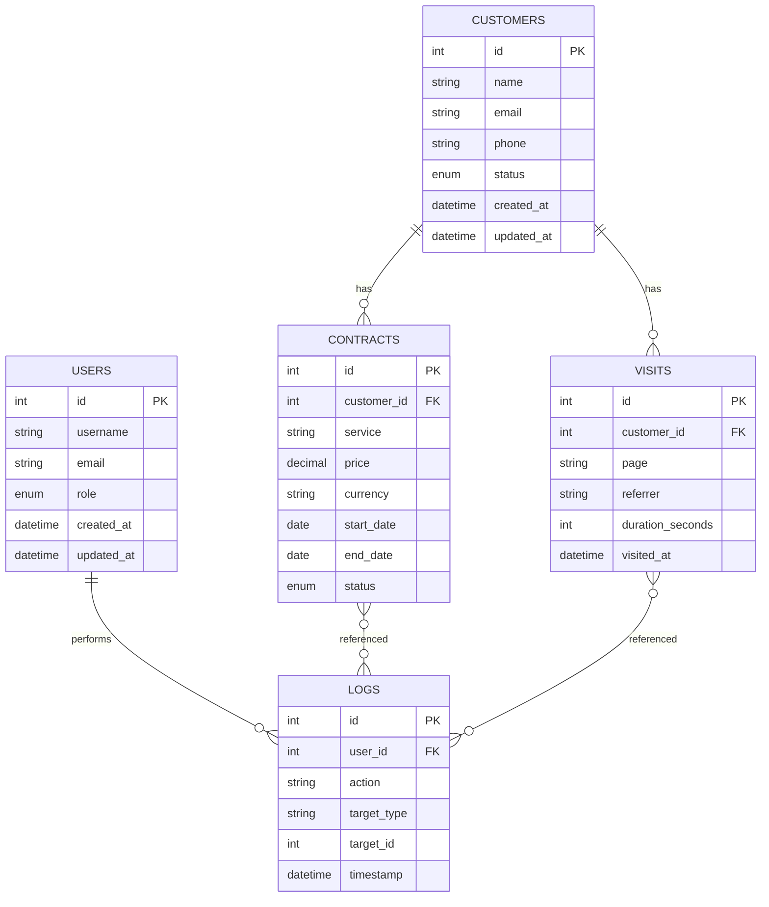
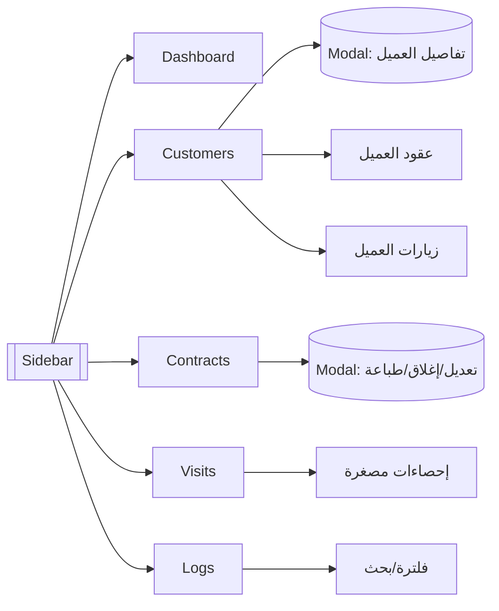

# مخطط واجهة الإدارة وعلاقات البيانات

يوضح هذا المستند العلاقات بين الجداول (ERD)، مخطط التصفح (Sitemap)، ومواصفات الصفحات والتنسيق لواجهة الإدارة (Admin UI) بشكل احترافي ومنظم.

## مخطط العلاقات (ERD)

## مخطط التصفح (Sitemap)

## مواصفات الصفحات

### لوحة القيادة (Dashboard)
- إحصاءات سريعة: إجمالي العملاء، العملاء الجدد اليوم، إجمالي العقود، الزيارات الأخيرة.
- رسوم بيانية: زيارات حسب الصفحة، عقود جديدة شهريًا، توزيع العملاء حسب الحالة.
- بطاقات (Cards) بمؤشرات الأداء مع رموز وحالة.

### العملاء (Customers)
- جدول أعمدة: الاسم، البريد، الهاتف، الحالة، تاريخ الإنشاء، عدد العقود، آخر زيارة.
- فلترة/بحث: الاسم، البريد، الحالة، تاريخ الإنشاء.
- إجراءات سريعة لكل صف: عرض العقود، عرض الزيارات، تعديل، حذف.
- Modal تفاصيل: معلومات العميل + تبويب للعقود والزيارات المرتبطة.
- Pagination وفرز بالأعمدة.

### العقود (Contracts)
- جدول أعمدة: رقم العقد، العميل، الخدمة، السعر، العملة، الحالة، البدء/الانتهاء.
- فلترة: حسب العميل، الحالة، نوع الخدمة، نطاق التواريخ.
- إجراءات: تعديل العقد، إغلاق العقد، طباعة.
- دعم تصدير CSV/PDF.

### الزيارات (Visits)
- جدول أعمدة: العميل، الصفحة، المحيل، مدة الزيارة، التاريخ/الوقت.
- فلترة: حسب العميل، الصفحة، التاريخ.
- إحصاءات مصغرة: إجمالي مدة الزيارات لكل عميل.

### السجلات (Logs)
- جدول أعمدة: المستخدم، الإجراء، العنصر المستهدف، الوقت.
- فلترة: حسب المستخدم، نوع العنصر، التاريخ.
- بحث سريع على كامل الحقول.

## المكونات المشتركة (Components)
- Sidebar: تنقل بين Dashboard, Customers, Contracts, Visits, Logs؛ قابل للإخفاء على الهواتف.
- Header: بحث عام، إشعارات، اسم المستخدم.
- Tables: فرز وفلترة، حجم صفحة قابل للتغيير، مؤشرات تحميل، حالة فارغة.
- Filters: شريط علوي أو جانبي، عناصر اختيار متعددة، نطاقات تاريخ.
- Pagination: أزرار السابق/التالي، قفز لصفحة، حجم الصفحة.
- Modals: إضافة/تعديل العملاء أو العقود، تأكيدات الحذف.
- Charts: خطوط/أعمدة/دونات للإحصاءات الرئيسية.

## التنسيق والألوان
- ألوان هادئة بتباين جيد؛ خطوط: Roboto أو Inter.
- رموز الحالة:
  - Active → أخضر
  - Pending → أصفر
  - Inactive/Closed → أحمر

## Responsive Design
- الجداول تتكيف مع الشاشات الصغيرة (طي الأعمدة أو تمرير أفقي).
- Sidebar يختفي أو يندمج في زر Hamburger.
- بطاقات إحصاءات بصفوف متعددة على الهواتف.

## وظائف إضافية
- Export/Print: CSV أو PDF للعملاء، العقود، الزيارات.
- اختصارات سريعة من الجدول: تعديل، حذف، طباعة، إضافة جديد.
- روابط مرتبطة:
  - العميل → قائمة العقود + الزيارات.
  - العقد → تفاصيل العميل وتاريخه.

## خريطة بيانات إلى الواجهة (مرجع تقني مختصر)
- العملاء: list، detail، create/update/delete.
- العقود: list، by-customer، edit/close/print.
- الزيارات: list، by-customer، إحصاءات.
- السجلات: list، filter/search.

> هذا المخطط يُعد مرجع التنفيذ للـ Admin UI، ويمكن تحويله مباشرة إلى صفحات ومكونات مع الحفاظ على القابلية للتوسعة.